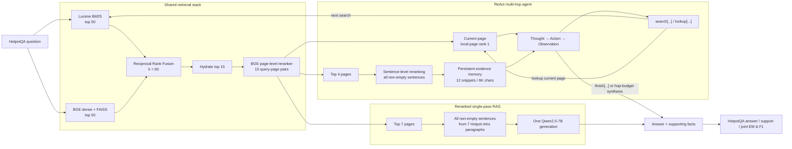

# ReAct Multi-Hop Question Answering on HotpotQA FullWiki

A FullWiki multi-hop QA project comparing a **reranked single-pass RAG baseline** with a **ReAct agent** under a controlled retrieval stack. Both systems use the same frozen `Qwen/Qwen2.5-7B-Instruct` reader, the same Lucene BM25 + BGE/FAISS hybrid retrieval backend, and the same `BAAI/bge-reranker-base` page reranker. The key experimental difference is **one-shot evidence acquisition versus adaptive Thought → Action → Observation retrieval**.

No LLM fine-tuning or post-training is used.

## Final Result

Evaluated on all **7,405 HotpotQA FullWiki dev questions**:

| Metric | Reranked RAG | ReAct | Gain |
| :--- | ---: | ---: | ---: |
| Answer EM | 40.45 | **46.67** | **+6.23 pp** |
| Answer F1 | 51.80 | **60.48** | **+8.68 pp** |
| Supporting Fact EM | 9.66 | **14.91** | **+5.25 pp** |
| Supporting Fact F1 | 43.97 | **52.25** | **+8.28 pp** |
| Joint EM | 6.08 | **9.44** | **+3.36 pp** |
| **Joint F1** | 26.86 | **37.11** | **+10.25 pp** |

The same Joint-F1 gain persists across both major HotpotQA question types:

| Question type | n | Reranked RAG | ReAct | Gain |
| :--- | ---: | ---: | ---: | ---: |
| Bridge | 5,918 | 22.71 | **32.94** | **+10.23 pp** |
| Comparison | 1,487 | 43.38 | **53.71** | **+10.33 pp** |

The quality gain has a systems cost: mean latency increases from **23.64 s** for the single-pass baseline to **64.40 s** for ReAct, while average trajectory length increases from **1.00** to **3.35** actions.

> The final comparison figures and data-driven report are generated from `results.json` and `run_manifest.json` by `eval/compare_results.py`; no result values are hard-coded in the plotting pipeline.

After running the comparison command below, GitHub-ready SVGs are published to `docs/results/`:

- `official_metrics_comparison.svg` — headline official metrics
- `joint_f1_by_question_type.svg` — bridge/comparison breakdown
- `evidence_coverage_comparison.svg` — retrieved evidence exposure
- `paired_outcome_transitions.svg` — rescues versus regressions
- `quality_cost_tradeoff.svg` — quality/latency tradeoff
- `react_quality_by_hops.svg` — trajectory-length diagnostic

---

## Architecture



The editable Mermaid source is also stored at [`docs/architecture.mmd`](docs/architecture.mmd).

### Shared retrieval stack

1. **BM25:** Lucene/Pyserini retrieves top 50 candidates.
2. **Dense:** `BAAI/bge-base-en-v1.5` + FAISS retrieves top 50 candidates.
3. **Fusion:** reciprocal-rank fusion with `rrf_k=60`.
4. **Hydration:** top 15 fused Wikipedia intro documents are loaded with original HotpotQA sentence IDs.
5. **Page reranking:** `BAAI/bge-reranker-base` scores one full-intro query/page pair for each of the 15 pages.

### Reranked single-pass RAG baseline

The baseline deliberately shares the strong page-level retrieval/reranking stack with ReAct:

- one retrieval from the original question;
- page-level BGE reranking over 15 hydrated pages;
- top 7 pages passed to the reader;
- every non-empty sentence from each stored HotpotQA intro paragraph is exposed with its original `[title, sentence_id]`;
- one Qwen generation;
- no sentence reranker, memory, lookup, second search, or iterative reasoning.

This makes the baseline a controlled **RAG + reranking** comparator rather than a straw-man retrieval system.

### ReAct agent

For every `search[...]` action:

1. retrieve/fuse/hydrate using the shared stack;
2. page-rerank all 15 candidates **locally for the current query**;
3. establish one current page for ReAct navigation;
4. exhaustively sentence-rerank every non-empty sentence in exactly the top 4 pages;
5. update a bounded persistent evidence memory of at most **12 snippets / 6,000 characters**;
6. let the next Thought choose `search[...]`, `lookup[...]`, or `finish[...]`.

Important invariants:

- Cross-encoder logits are **never compared across different search queries**.
- Persistent evidence memory can never change which page `lookup[...]` operates on.
- `lookup[...]` always searches the current page selected by the latest search.
- Sentence scores select evidence snippets but do not feed back into page ranking.
- All original HotpotQA sentence IDs are preserved.
- Maximum tool budget is 7 actions; a final synthesis call prevents empty termination at the budget.

---

## Dataset and Retrieval Corpus

The reported experiment uses HotpotQA's **FullWiki** setting and the official October 1, 2017 Wikipedia introductory-paragraph archive:

`enwiki-20171001-pages-meta-current-withlinks-abstracts.tar.bz2`

The project preserves the source sentence segmentation and 0-based sentence IDs so predicted supporting facts remain compatible with the official HotpotQA evaluator.

The final index contains approximately **5.23 million** Wikipedia intro documents:

- Lucene BM25 through Pyserini/Anserini;
- BGE dense embeddings (`BAAI/bge-base-en-v1.5`, 768-D);
- FAISS IVF-PQ (`IVF4096,PQ96x8`, `nprobe=32`);
- reciprocal-rank fusion over sparse and dense rankings.

Dense corpus encoding is performed once during index construction. Benchmark-time dense query encoding runs on CPU so the L4 can be shared by vLLM and the page/sentence cross-encoder.

---

## Evaluation

Both final runs use:

- **dataset:** official HotpotQA FullWiki dev, 7,405 questions;
- **reader:** `Qwen/Qwen2.5-7B-Instruct`;
- **serving:** vLLM;
- **concurrency:** 64;
- **retrieval:** BM25 top-50 + dense top-50 + RRF;
- **page reranker:** `BAAI/bge-reranker-base`;
- **failures:** 0 in both final runs.

Official HotpotQA formulas are used for:

- Answer EM / F1
- Supporting Fact EM / F1
- Joint EM / F1

The project also records clearly labeled diagnostics that are **not** official leaderboard metrics:

- supporting-document F1;
- observed gold-document recall;
- observed gold supporting-fact recall;
- percentage of questions for which all gold supporting facts were exposed to the model.

### Final post-processing command

After `eval_results/baseline/` and `eval_results/react/` contain their final `results.json` and `run_manifest.json` files:

```bash
python eval/compare_results.py \
  --baseline eval_results/baseline/results.json \
  --react eval_results/react/results.json \
  --output-dir eval_results/comparison \
  --publish-dir docs/results
```

The script first performs strict comparability checks. It refuses to generate a report if the two runs disagree on question IDs, question/gold content, dataset, model, concurrency, corpus hash, BM25/dense corpus size, hybrid retrieval parameters, or page-reranker configuration.

It then generates:

```text
eval_results/comparison/
├── comparison.log
├── comparison_report.md
├── comparison_summary.json
├── official_metrics_comparison.{png,svg}
├── joint_f1_by_question_type.{png,svg}
├── evidence_coverage_comparison.{png,svg}
├── paired_outcome_transitions.{png,svg}
├── quality_cost_tradeoff.{png,svg}
└── react_quality_by_hops.{png,svg}
```

Trackable publication artifacts are copied automatically to:

```text
docs/results/
├── comparison_report.md
├── comparison_summary.json
├── official_metrics_comparison.svg
├── joint_f1_by_question_type.svg
├── evidence_coverage_comparison.svg
├── paired_outcome_transitions.svg
├── quality_cost_tradeoff.svg
└── react_quality_by_hops.svg
```

The final Markdown report includes the experimental-validity table, official metric deltas in **percentage points**, question-type analysis, evidence acquisition diagnostics, paired rescue/regression counts, latency percentiles, reranker workload, and ReAct quality by trajectory length.

---

## End-to-End Reproduction on GCE L4

Target used for the final experiment: NVIDIA L4 (24 GB), 32 GB system RAM, Ubuntu 22.04.

### 1. Environment

```bash
conda env create -f environment.yml
conda activate hotpot
export LD_LIBRARY_PATH=$CONDA_PREFIX/lib:$LD_LIBRARY_PATH
```

For an existing environment:

```bash
conda env update -f environment.yml --prune
conda activate hotpot
export LD_LIBRARY_PATH=$CONDA_PREFIX/lib:$LD_LIBRARY_PATH
```

### 2. Build the FullWiki index

```bash
python retrieval/build_fullwiki_index.py
```

The build verifies the official archive checksum, preserves sentence IDs, builds Lucene BM25 and FAISS dense indexes, and writes `indexes/fullwiki/manifest.json`.

Optional hyperlink-graph infrastructure remains available for separate experiments:

```bash
python tools/build_hyperlink_graph.py --output-dir indexes/fullwiki
```

**Graph expansion is disabled in the reported final ReAct benchmark.**

### 3. Retrieval sanity check

```bash
python retrieval/evaluate_retrieval.py \
  --source official_json \
  --modes bm25 dense hybrid \
  --ks 1 5 10 15 20
```

### 4. Launch Qwen/vLLM

```bash
LD_LIBRARY_PATH=$CONDA_PREFIX/lib:$LD_LIBRARY_PATH python -m vllm.entrypoints.openai.api_server \
  --model Qwen/Qwen2.5-7B-Instruct \
  --host 0.0.0.0 \
  --port 8000 \
  --dtype bfloat16 \
  --gpu-memory-utilization 0.85 \
  --max-model-len 8192
```

### 5. Tests

```bash
PYTHONPATH=. pytest tests/
```

### 6. Final reranked RAG baseline

```bash
python eval/run_baseline.py \
  --config config/fullwiki.yaml \
  --source official_json \
  --concurrency 64 \
  --output-dir eval_results/baseline
```

### 7. Final ReAct benchmark

```bash
python eval/run_eval.py \
  --config config/fullwiki.yaml \
  --source official_json \
  --concurrency 64 \
  --disable-graph-expansion \
  --output-dir eval_results/react
```

### 8. Final comparison and publication artifacts

```bash
python eval/compare_results.py \
  --baseline eval_results/baseline/results.json \
  --react eval_results/react/results.json \
  --output-dir eval_results/comparison \
  --publish-dir docs/results
```

Optional: verify evaluator-format predictions independently:

```bash
python hotpot_evaluate_v1.py \
  eval_results/react/official_predictions.json \
  eval_results/react/official_gold.json
```

---

## Key Implementation Safeguards

- Native ChatML message structure for Qwen.
- Hard generation stop sequences at `Observation:` to prevent the model from inventing tool outputs.
- Robust action parser preserving parentheses inside `search[...]` / `lookup[...]` payloads.
- Consecutive duplicate-search guard.
- Forced final synthesis at the hop budget.
- Query-local page reranking instead of cross-query score accumulation.
- Current-page navigation strictly separated from persistent evidence memory.
- Sentence-level evidence memory with original HotpotQA sentence IDs.
- Shared cross-worker cross-encoder batching for efficient GPU inference.
- Run manifests containing exact corpus/index/model/configuration metadata.
- Final comparison validation that fails closed on mismatched experiments.

---

## Repository Structure

```text
hotpot/
├── agent/
│   ├── baseline_rag.py
│   ├── engine.py
│   ├── parser.py
│   ├── prompt.py
│   └── state.py
├── retrieval/
│   ├── build_fullwiki_index.py
│   ├── corpus.py
│   ├── evaluate_retrieval.py
│   ├── fullwiki_retriever.py
│   └── reranker.py
├── eval/
│   ├── artifacts.py
│   ├── compare_results.py
│   ├── dataset.py
│   ├── metrics.py
│   ├── plot_results.py
│   ├── run_baseline.py
│   └── run_eval.py
├── docs/
│   └── architecture.mmd
├── portfolio/
├── tests/
├── config/
│   └── fullwiki.yaml
├── config.py
├── environment.yml
├── requirements.txt
└── README.md
```

---

## Final Takeaway

With the reader and first-stage retrieval/reranking stack held fixed, adaptive ReAct retrieval improves **Joint F1 by 10.25 percentage points** over the reranked single-pass baseline on the complete 7,405-question HotpotQA FullWiki dev set. The improvement appears in both bridge and comparison questions and is accompanied by higher observed gold-evidence coverage, at the explicit cost of additional tool calls and approximately 2.7× mean latency.

## License

MIT License. The HotpotQA Wikipedia corpus is distributed separately under the license stated by the HotpotQA authors; generated corpus/index files are not committed to this repository.
