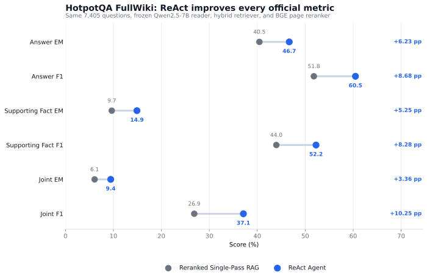
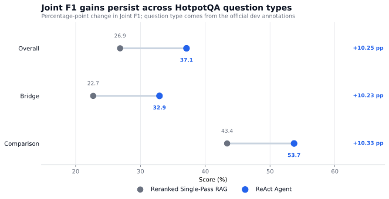
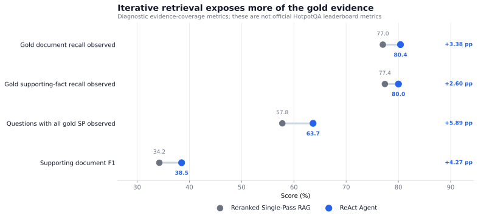
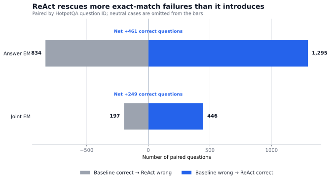
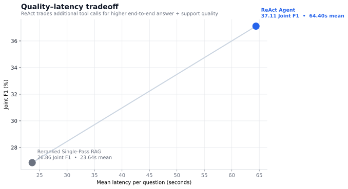
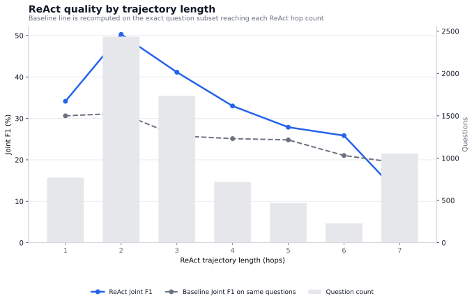

# HotpotQA FullWiki: Final ReAct vs Reranked RAG Comparison

Across the same **7,405 HotpotQA FullWiki dev questions**, the ReAct agent improves Joint F1 from **26.86** to **37.11** (**+10.25 percentage points**) over a reranked single-pass RAG baseline using the same frozen reader, hybrid retriever, and BGE page reranker. The gain comes at **2.72×** mean per-question latency.

## 1. Experiment Validity

The comparison script pairs records by HotpotQA question ID and refuses to continue if the runs disagree on question/gold identity or the shared retrieval stack.

| Shared setting | Value |
| :--- | :--- |
| model | `Qwen/Qwen2.5-7B-Instruct` |
| dataset source | `official_json` |
| dataset size | `7405` |
| retrieval mode | `fullwiki` |
| retriever | `hybrid` |
| concurrency | `64` |
| candidate_k | `50` |
| rrf_k | `60` |
| dense model | `BAAI/bge-base-en-v1.5` |
| dense nprobe | `32` |
| page reranker model | `BAAI/bge-reranker-base` |

**Intended experimental difference:** the baseline performs one retrieval and one generation over the top seven reranked pages; ReAct performs adaptive `search` / `lookup` actions with query-local page reranking, sentence-level evidence selection, and bounded persistent snippet memory.

## 2. Headline Official Metrics

| Metric | Reranked RAG | ReAct | Gain |
| :--- | ---: | ---: | ---: |
| Answer EM | 40.45 | **46.67** | **+6.23 pp** |
| Answer F1 | 51.80 | **60.48** | **+8.68 pp** |
| Supporting Fact EM | 9.66 | **14.91** | **+5.25 pp** |
| Supporting Fact F1 | 43.97 | **52.25** | **+8.28 pp** |
| Joint EM | 6.08 | **9.44** | **+3.36 pp** |
| Joint F1 | 26.86 | **37.11** | **+10.25 pp** |

## 3. Bridge vs Comparison Questions

| Question type | n | RAG Joint F1 | ReAct Joint F1 | Gain |
| :--- | ---: | ---: | ---: | ---: |
| Overall | 7,405 | 26.86 | **37.11** | **+10.25 pp** |
| Bridge | 5,918 | 22.71 | **32.94** | **+10.23 pp** |
| Comparison | 1,487 | 43.38 | **53.71** | **+10.33 pp** |

## 4. Evidence Acquisition Diagnostics

These are diagnostic retrieval/exposure metrics, not official HotpotQA leaderboard metrics.

| Diagnostic | Reranked RAG | ReAct | Gain |
| :--- | ---: | ---: | ---: |
| Observed gold document recall | 77.02 | **80.40** | **+3.38 pp** |
| Observed gold supporting-fact recall | 77.41 | **80.01** | **+2.60 pp** |
| Questions with all gold SP observed | 57.79 | **63.67** | **+5.89 pp** |
| Supporting document F1 | 34.25 | **38.52** | **+4.27 pp** |

## 5. Paired Exact-Match Outcomes

Because both systems answer the same questions, exact-match transitions show how often ReAct rescues or breaks a baseline outcome.

| Outcome | Answer EM | Joint EM |
| :--- | ---: | ---: |
| Baseline wrong → ReAct correct | **1,295** | **446** |
| Baseline correct → ReAct wrong | 834 | 197 |
| Net additional correct | **+461** | **+249** |

## 6. Efficiency / Quality Tradeoff

| Measure | Reranked RAG | ReAct |
| :--- | ---: | ---: |
| Mean latency | 23.64s | 64.40s |
| Median latency | 22.33s | 56.02s |
| P90 latency | 31.38s | 108.95s |
| P95 latency | 34.84s | 122.55s |
| Average hops | 1.00 | 3.35 |
| Cross-encoder pairs / question | 15.0 | 55.4 |
| Total cross-encoder pairs | 111,075 | 410,359 |
| Total evaluation wall time | 45.69 min | 124.72 min |
| Wall throughput | 2.70 q/s | 0.99 q/s |

ReAct gains **+10.25 Joint-F1 points** at **2.72×** the mean per-question latency of the single-pass baseline.

## 7. ReAct Quality by Trajectory Length

Trajectory length is endogenous: questions reaching many hops are the unresolved/difficult tail, so this is a diagnostic rather than a causal comparison. The baseline column is recomputed on the exact questions in each ReAct hop-count bucket.

| ReAct hops | Questions | ReAct Joint F1 | Baseline Joint F1 on same questions |
| ---: | ---: | ---: | ---: |
| 1 | 768 | 34.13 | 30.62 |
| 2 | 2,435 | 50.26 | 31.21 |
| 3 | 1,735 | 41.14 | 25.79 |
| 4 | 717 | 32.98 | 25.11 |
| 5 | 467 | 27.87 | 24.80 |
| 6 | 228 | 25.84 | 21.04 |
| 7 | 1,055 | 11.62 | 19.20 |

## 8. Interpretation

- ReAct improves **Joint F1 by 10.25 percentage points** overall while improving every official answer/support metric.
- Joint-F1 gains are similar for bridge (**+10.23 pp**) and comparison (**+10.33 pp**) questions, so the improvement is not confined to one HotpotQA subtype.
- Complete gold-support exposure increases by **+5.89 percentage points**, consistent with adaptive retrieval finding useful evidence beyond one-shot retrieval.
- ReAct rescues **1,295** baseline Answer-EM failures while regressing on **834**, a net gain of **461** exactly-correct answers.
- The quality gain has a clear systems cost: mean latency rises from **23.64s** to **64.40s** per question.
